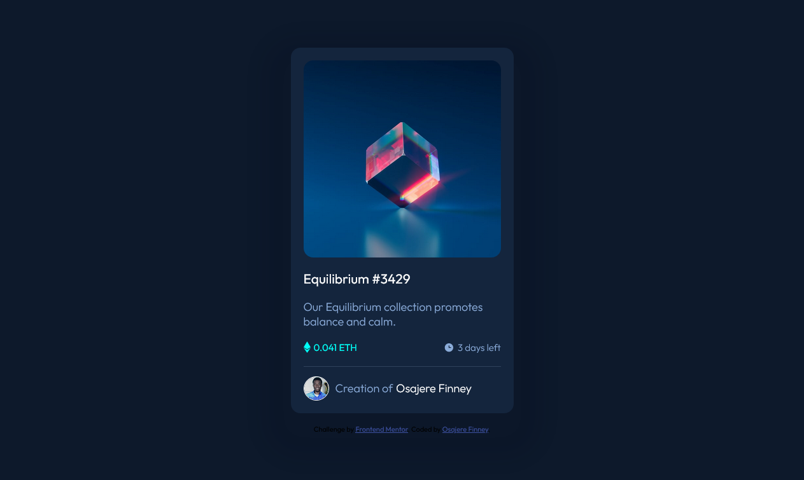
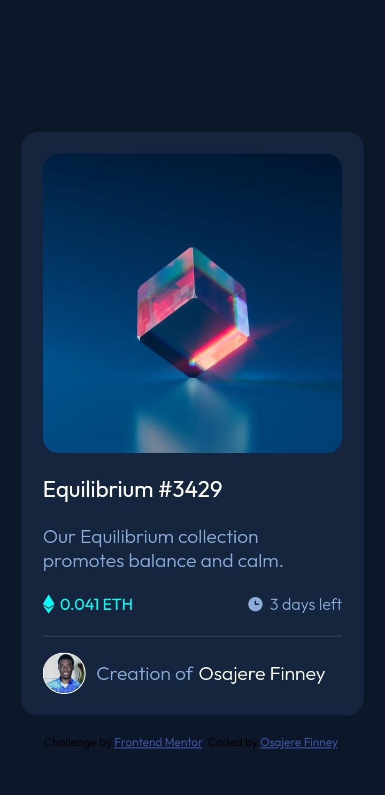

# Frontend Mentor - NFT preview card component solution

This is a solution to the [NFT preview card component challenge on Frontend Mentor](https://www.frontendmentor.io/challenges/nft-preview-card-component-SbdUL_w0U). Frontend Mentor challenges help you improve your coding skills by building realistic projects. 

## Table of contents

- [Overview](#overview)
  - [The challenge](#the-challenge)
  - [Screenshot](#screenshot)
  - [Links](#links)
- [My process](#my-process)
  - [Built with](#built-with)
  - [What I learned](#what-i-learned)
  - [Continued development](#continued-development)
  - [Useful resources](#useful-resources)
- [Author](#author)
- [Acknowledgments](#acknowledgments)

## Overview

### The challenge

Users should be able to:

- View the optimal layout depending on their device's screen size
- See hover states for interactive elements

### Screenshot

### Desktop Design Screenshot
 

 ### Mobile Design Screenshot

### Links

- Solution URL: [Add solution URL here](https://www.frontendmentor.io/solutions/nft-preview-card-component-fobD8AVFZA)
- Live Site URL: [Add live site URL here](https://finney06.github.io/NFT-preview-card-component/)

## My process

### Built with

- Semantic HTML5 markup
- CSS custom properties
- Flexbox
- Positioning

### What I learned

I was able to fully understand how to use flexbox to center element and was alson able to understand how to position the svg eye icon and create the hover effent on the NFT preview card component.

To see how you can add code snippets, see below:

### Continued development

I would love to learn more about positioning and CSS grid system also to take more of front end challenges to get better at my front end skills.

### Useful resources

- [Slack](https://frontendmentor.slack.com/archives/CCYHFT85B/p1652445926488529) -This helped me quite understand how i should go about the hover effent on the equilibrum image.
- [Front-end Mentor](https://www.frontendmentor.io/solutions/nft-preview-card-component-fobD8AVFZA) -Through the community feedbacks i was able to use Semantics html markup on my HTML code for more accessibility and finally understood how to get the hover effect on the equilibrum image.

## Author

- Website - [Osajere Finney](https://finney06.github.io/profile-card-component/)
- Frontend Mentor - [@Finney06](https://www.frontendmentor.io/profile/Finney06)
- Twitter - [@Osa_finney](https://www.twitter.com/@Osa_finney)

## Acknowledgments

I would like to acknowledge the people that answered my questions on frontend mentor  [@Grace] (https://frontendmentor.slack.com/team/U01D6CR3C68)from Slack for also helping me out with the hover effect.
